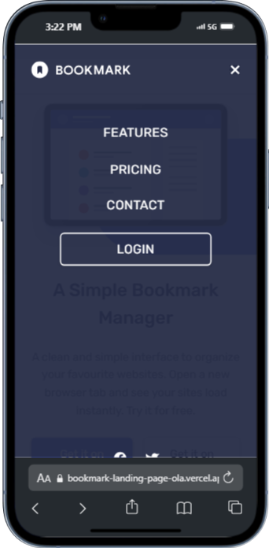
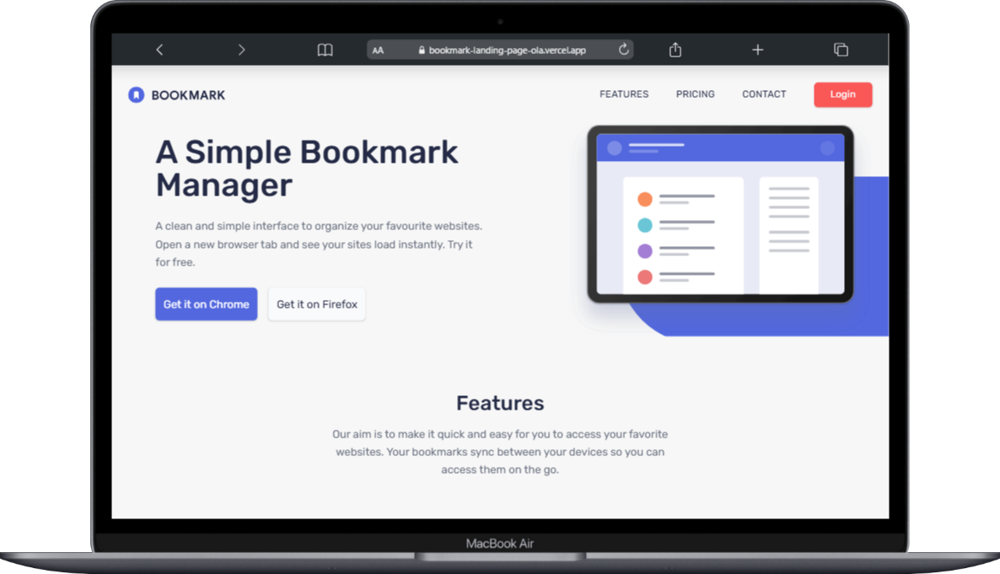

# Frontend Mentor - Bookmark Landing Page Solution

**A fully responsive, modern landing page built with React, Vite, and Tailwind CSS, featuring clean UI design, form validation, and smooth mobile-first layouts.**
This project replicates the Bookmark landing page design from Frontend Mentor, translating it into a high-performance, production-ready build. The mobile view has been carefully optimized for usability, while the desktop layout is structured for clarity and visual appeal.

---

## Table of contents

* [Overview](#overview)

  * [The challenge](#the-challenge)
  * [Screenshot](#screenshot)
  * [Links](#links)
* [My process](#my-process)

  * [Built with](#built-with)
  * [What I learned](#what-i-learned)
  * [Continued development](#continued-development)
* [Author](#author)
* [Acknowledgments](#acknowledgments)

---

## Overview

### The challenge

Users should be able to:

* View the optimal layout for the site depending on their device's screen size
* See hover states for all interactive elements on the page
* Receive an error message when the newsletter form is submitted if:

  * The input field is empty
  * The email address is not formatted correctly

### Screenshot

Navbar



Mobile View


Desktop View



### Links

* **Solution URL:** [Solution URL](https://github.com/BANKOLEDO/bookmark-landing-page)
* **Live Site URL:** [Live Site](https://bookmark-landing-page-ola.vercel.app/)

---

## My process

### Built with

* **Semantic HTML5 markup**
* **CSS custom properties**
* **Flexbox**
* **CSS Grid**
* **Mobile-first workflow**
* **React** – for UI logic and component structure
* **Vite** – for fast development and build
* **Tailwind CSS** – for styling

---

### What I learned

This project helped me refine:

* Component-based architecture in React for scalability
* Tailwind CSS for rapid, consistent styling across breakpoints
* Handling form validation with user-friendly error messaging
* Managing file paths and case sensitivity for smooth deployment

Example of email validation in React:

```jsx

export default function Contact() {
  const [email, setEmail] = useState("");
  const [touched, setTouched] = useState(false);

  const isValid = /^[^\s@]+@[^\s@]+\.[^\s@]+$/.test(email);

  return (
    
        <form
          className="flex flex-col md:flex-row gap-4 justify-center items-center mt-6"
          onSubmit={(e) => {
            e.preventDefault();
            setTouched(true);
          }}
        >
          <div className="w-full md:w-auto relative">
            <input
              type="email"
              value={email}
              onChange={(e) => setEmail(e.target.value)}
              onBlur={() => setTouched(true)}
              placeholder="Enter your email address"
              className={`px-4 py-3 rounded-md text-blue-950 w-full md:w-[20rem] focus:outline-none transition-all
                ${
                  touched && !isValid
                    ? "border-2 border-red-500"
                    : "border-2 border-transparent md:mt-5"
                }
              `}
              required
            />
            {touched && !isValid && (
              </img>
            )}
            {touched && !isValid && (
              <span className="absolute left-0 top-full text-xs text-white text-left bg-red-500 w-full px-2 py-[0.15rem] rounded-b-md shadow">
                Whoops, make sure it’s an email
              </span>
            )}
          </div>
          <button
            type="submit"
            className="bg-red-500 text-white w-full md:w-[10rem] mt-4 px-6 py-3 rounded-md font-medium shadow hover:bg-red-600 transition"
          >
            Contact Us
          </button>
        </form>
      </div>
    </section>
  );
}
```

---

### Continued development

Future enhancements I want to explore:

* Adding subtle animations for section transitions
* Improving accessibility with ARIA attributes and keyboard navigation support
* Using a form library for more advanced validation logic

---

## Author

* **Github** – [BANKOLEDO](https://github.com/BANKOLEDO)
* **Frontend Mentor** – [@BANKOLEDO](https://www.frontendmentor.io/profile/BANKOLEDO)
* **Twitter/X** – [@dev_olabanks](https://www.twitter.com/dev_olabanks)

---

## Acknowledgments

Thanks to the Frontend Mentor community for their feedback-driven approach and for providing high-quality design challenges that encourage attention to detail.

---
